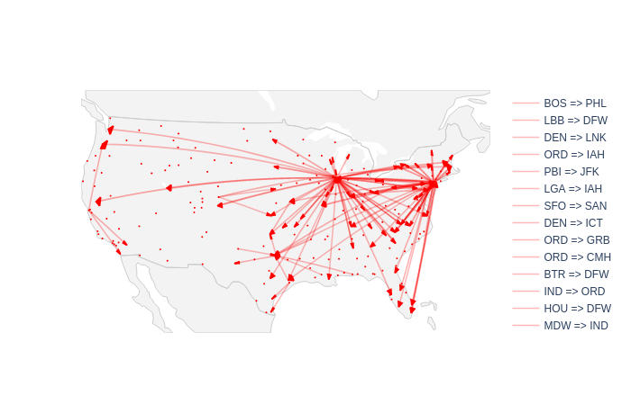
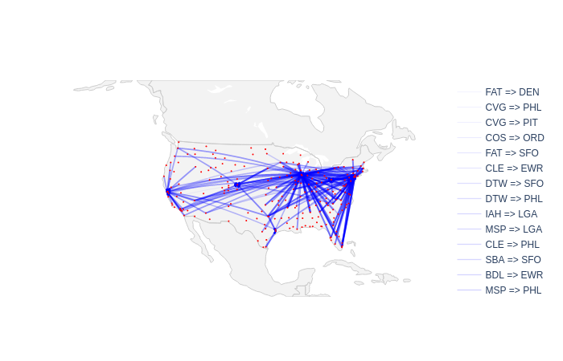

## Introduction

In this blog post, we are going to study a dataset of US only flights during the year 2007. The dataset was released by the [American Statistical Association](https://www.amstat.org/) as part of their [Bi-Annual Data exposition](http://stat-computing.org/dataexpo/). During the competition, participants were asked to focus on only one question and try answering it by investigating the dataset. The question we are going to try to answer is:

> Can you detect cascading failures as delays in one airport create delays in others? Are there critical links in the system?

The data originally comes from the Bureau of Transportation statistics where [it can be downloaded](https://www.transtats.bts.gov/DL_SelectFields.asp) by month. For this analysis, I will be using the data for the year 2007 where all months have been concatenated in one file.

## Pre-requisite work

Before being able to do any analysis, we need a way to load this flight data into Spark. As the data is a `csv` file, we can use the standard `csv` module in Python.


import csv

def read_csv(path):
  with open(path, 'r') as f:
    for row in csv.DictReader(f):
      flight = transform_row(row)
      yield flight


The `read_csv` function is a [generator function](https://wiki.python.org/moin/Generators) which means that **the data will never be fully loaded into memory** but instead will be loaded for each record when it is required. This is important because if we tryed loading everything at once, with `pandas.read_csv` the memory footprint of our program would be similar to the size of the csv file (\~600Mb).

The `transform_row` function is just a function to map from the dictionnary returned by the `DictReader` to our own data class. We can use a `namedtuple` to create one easily. To know which field are present in the file and what they mean, you can refer to [the documentation](http://stat-computing.org/dataexpo/2009/the-data.html). But it is also a good practice to open the file in an editor that can support it or using `less -S` (the `-S` option is to avoid line-wrapping) in order to check the different types of values we could encounter when reading the file.


import collections
import datetime

Flight = collections.namedtuple(
  "Flight",
  ("date", "origin", "flightNum", 
    "destination", "delay", 
    "carrierDelay", "weatherDelay", 
    "NASDelay", "securityDelay",
    "lateAircraftDelay")
)

def transform_row(row):
  year = int(row['Year'])
  month = int(row['Month'])
  day_of_month = int(row['DayofMonth'])
  arr_delay = row['ArrDelay']

  # Skip flight with na delay
  if arr_delay == 'NA':
    delay = 0
  else:
    delay = int(arr_delay)

  flight_num = int(row['FlightNum'])

  dep_time = row['CRSDepTime'].zfill(4)

  dep_hour = int(dep_time[:2])
  dep_minute = int(dep_time[2:])

  carrierDelay = int(row['CarrierDelay'])
  weatherDelay = int(row['WeatherDelay'])
  NASDelay = int(row['NASDelay'])
  securityDelay = int(row['SecurityDelay'])
  lateAircraftDelay = int(row['LateAircraftDelay'])

  origin = row['Origin']
  destination = row['Dest']

  cancelled = row['Cancelled']
  diverted = row['Diverted']

  date = datetime.datetime(year=year, month=month, 
    day=day_of_month, hour=dep_hour, minute=dep_minute)

  return Flight(date, origin, 
    flight_num, destination, 
    delay, carrierDelay, weatherDelay,
    NASDelay, securityDelay, lateAircraftDelay)
 


We now have a way to stream flight records to our Spark cluster. Let's first get a sense of how many records we will handle:

```bash
➜ cat 2007.csv | wc -l
7453216
```

The file contains 7453216 lines, including one for the header. So we should be able able to find this back after making a Map-reduce.

## Computing the metrics

Even though 7M records is not an enormous dataset, we will use Apache Spark to compute the metrics needed for our analysis. Spark makes computing tasks distributed across multiple nodes. However, to use its distributed power we must change our programming paradigm and use mapping and reduce functions instead of loops.

We start by connecting to Spark and creating our distributed dataset:


def get_rdd(file, sc=None):
  if sc is None:
    sc = SparkContext()
  return sc.parallelize(generator, numSlices=1000)


We will then compute the mean and variance for the late aircraft delay values. In fact we consider that there has been a delay propagation with the following conditions:

- The flight is late on arrival
- The plane takes of late
- The plane arrives late at his next location

As the two last points are already computed by the presence of positive Late Aircraft delay value, it must only be arrived late as well to see whether or not there was a delay propagation. The statistic which give the proportion of flights being delayed because of a delay propagation will also be computed.


def is_delay_prop(flight):
  return 1 if flight.lateAircraftDelay > 0 and flight.delay > 0 else 0

def delay_relations(D):
  def first_map(flight):
    key = (flight.origin, flight.destination)
    value = (1, is_delay_prop(flight), flight.delay, flight.delay**2, flight.lateAircraftDelay, flight.lateAircraftDelay**2)
    return key, value

  def second_map(acc):
    (origin, destination), (N, S, X, X2, LAD, LAD2) = acc
    if N > 0:
      mean = X/N
      mean_lad = LAD/N
      std = np.sqrt(X2/N - mean**2)
      std_lad = np.sqrt(LAD2/N - mean**2)
    return origin, destination, N, S/N, mean, std, mean_lad, std_lad
  results = D.map(first_map).reduceByKey(sum_n).map(second_map).collect()
  return results


The following two lines can be launched to get the results and start exploiting them:


D = get_rdd('2007.csv')
results = delay_relations(D)


## Analysing the results

I decided to apply a filter to the lines to reduce the noise of the small lines with very few yearly flights. This is to better identify the lines which are the most impacted by delay propagation. I choose to filter out the lines with less than 1200 yearly flights. The ones with more than 1200 flights will also be filtered with at least 10% of those flights being delay propagations and with the delay propagated being in average higher than 10 minutes. I then used plotly to plot those airlines onto a map, the result can be seen on Figure 1:

{{}}

We can see than some airports seem more affected to delay propagation than others. For example, the following airports seem quite sensible:

- SFO, San Fransisco International Airport
- ORD, O'Hare International Airport in Chicago

Below is a list of every airports which have more than three airlines corresponding to the criterias above:

| IATA | Number of impacted airlines | Number of flights on the concerned airlines |
|-|-|-|
| ORD  | 48               | 135 275                                   |
| EWR  | 26               | 64 771                                    |
| LGA  | 7                | 25 236                                    |
| PHL  | 6                | 16 999                                    |
| SFO  | 3                | 10 079                                    |
| HOU  | 3                | 7 246                                     |
| PIT  | 3                | 5 845                                     |
| DEN  | 3                | 5 488                                     |



Now, it can be interesting to look at whether or not every airlines which fly towards those airports are responsible for the late arrival or not. Once again, only the lines which arrive with a delay of more than 10 minutes and at least 1200 flights are considered. It is interesting to note than on those flights, 15% come from the aiports cited in .
It means that 15% of the flights between those sensitive aiports come from those same sensitive airports.
This is maybe due to the fact that some planes are doing regular connections between two aiports multiple times a day. Thus, a delay which would come on one flight of those plane would have a high likelyhood to delay the next flights as well. In those delay sources, some airports come back often like for example, DFW, Dallas' Airport which has a regular connection with 8 of the aiports cited in .
 shows the airlines which bring in average most of the delay to the airports which are the most susceptible to transmit the delay.

{{}}

## Conclusion

> These airports don't receive delayed aircrafts more than others. They have critical points of failures that lead to amplifying existing delays.

In conclusion, some aiports have a higher tendancy than others to propagate the delays of incoming aircrafts. This could be explained by the fact that those airports are not maintenance aiports and that the time that an aircraft spends in these aiports if rather small. It is not possible for airlines to reduce the ground period between two flights if it arrives late and must delay the next flight. It is for example the case for ORD, Chicago's airport. It is the second airport in terms of number of yearly flights (357 261 flights in 2007 according to the dataset) but its area (190 000m² according to Wikipedia) is three times lower than the 630,000m² of ATL, Atlanta's airport, the first american airport in number of yearly flights (404 971 flights in 2007 counting only internal flights). Chicago's airport must have a lot less room to perform maintenances and store replacement airplanes for commercial airlines. However, these airports don't receive delayed aircrafts more than others. They have critical points of failures that lead to amplifying existing delays.
