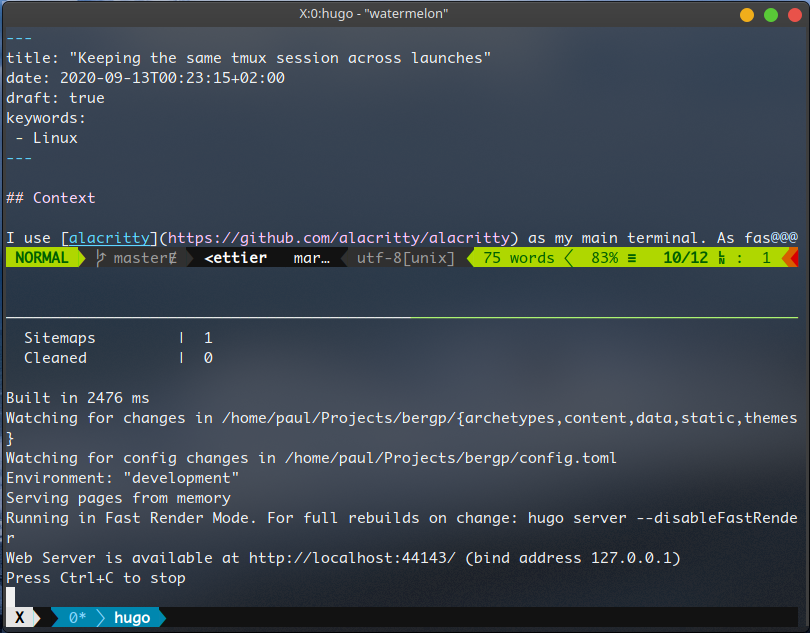

## Context

I use [alacritty](https://github.com/alacritty/alacritty) as my main terminal. As fast as it is, it doesn't come pre-configured with tabs or even other windows. So what most people do (me included), it that they use [tmux](https://github.com/tmux/tmux).
tmux is a terminal multiplexer (hence the name) which allows you to create windows and split them all over a terminal UI.

One of the best feature of tmux, which is often used over ssh, is persistence even when tmux is closed. This works because tmux as a client/server model. However, by default when launching tmux, it creates a new session which is not ideal because you need to reselect the previous one if you had processes running in it. In this blog post, I will show you how to keep the same session when alacritty restarts.

tmux as the option `-A` which make tmux try to attach to the session first and creates it if it doesn't exist yet. We start by creating a file launching tmux to attach a session named `X`.

```bash
#!/bin/bash
tmux new-session -A -s X
```

We then makes the files executable:

```bash
$ sudo chmod +x tmuxed
```

We can finally edit our alacritty configuration file located at `~/.config/alacritty/alacritty.yml` to change the default shell used by alacritty:

```yml
# Shell
#
# You can set `shell.program` to the path of your favorite shell, e.g. `/bin/fish`.
# Entries in `shell.args` are passed unmodified as arguments to the shell.
#
# Default:
#   - (macOS) /bin/bash --login
#   - (Linux/BSD) user login shell
#   - (Windows) powershell
shell:
  program: ~/tmuxed
```

And voila! Every time I launch alacritty I will now have the X session reused across all instances.

{{}}

