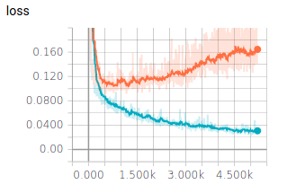
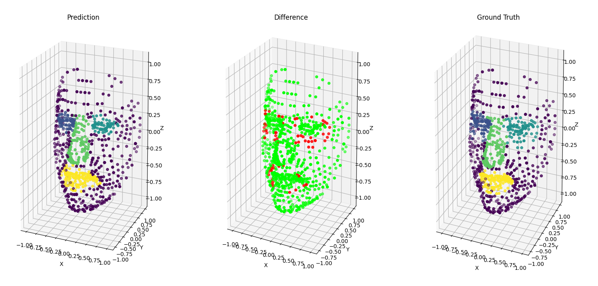

## 1. Introduction

### 1.1 Context

This paper was written by [Bilel Debbabi](https://www.linkedin.com/in/bilel-debbabi/) and myself ([Paul Berg](https://ber.gp)) during the semester of spring 2020. The work was done in the [_Université de Technologie de Compiègne_](https://utc.fr). Our work was supervised by Tien Tuan Dao which was supervising a thesis on facial rehabilitation.

### 1.2 Current situation

Traditional facial rehabilitation for facial palsy patients uses commonly visual feedback and subjective palpation techniques to evaluate the patient's progress. A computer vision system with real time feedback could be an innovative solution. 
Numerous computational methods have been proposed for simulating head and facial expression animations, but they hardly accomplished real-time frame rate and realistic animations. Actually, most studies could not simulate full rigid head and non-rigid facial animations in real-time.

### 1.3 Goal of the thesis

The goal is to develop a real-time computer vision system for tracking simultaneously rigid head and non-rigid facial mimic movements using a contactless Kinect sensor (version
2.0) and the system of systems approach.

### 1.4 Image acquisition

A Kinect is used. Different subsystems are run in parallel, each one having a specific task (Head animation,
Texture generation,&hellip;). These subsystems are then combined to generate the full 3D image.

{{}}

### 1.5 Problem constraints

When working with kinect data, we obtain a set of points in a 3D space (representing the head here). This data is called a point cloud. A point cloud is an unordered set of points, which means that the result of a computation on a point cloud must be independent of the point’s order. This problem can’t be solved by sorting because sorting in 3D space is a difficult problem, it is basically reducing from 3 dimensions to only 1.
Ideally, a cloud point classifier must be invariant to transformations (rotations, scaling, translations,&hellip;).

Point Clouds are often transformed to Voxels or images because there are a lot of techniques to manipulate fixed formats, however these formats do not really represent the true nature of 
point clouds which can have a non uniform density (due to sensors and distance for example, see figure&nbsp;1.5.1).

{{}}

### 1.6 Goal of the TX

In order to track the rehabilitation of the facial palsy patients, we need to
detect the different parts of the face (eyes, nose, mouth), from the generated
point cloud. This is what we'll try to accomplish, using a part segmentation
on the point cloud.

## 2. Comparison of current algorithms

We will start by studying the available algorithms used for point cloud segmentation. 

### 2.1 PointNet

PointNet has become the base solution for point cloud processing. 
It evaluates each point individually and then uses a symmetric function (a max pooling function) to create the global feature of the point cloud. 
This way, the order of the point has no effect on the global feature.
Then, by concatenating the global point cloud feature and the individual point feature it can produce a part segmentation classification. 

One of the main disadvantages of PointNet is that it doesn’t consider the local context because it only performs an evaluation on single point features and then every point features.

While simple, this architecture shows high performance on standard 3D datasets. 
Because it uses a max-pooling function to aggregate the individual point features, it is resistant to point loss and perturbations. However, because it doesn’t consider local features but only single point feature, 
it is sensitive to changes such as translation and rotation.

{{}}

### 2.2 PointNet++

As seen in section&nbsp;2.1, PointNet does not take into consideration the local environment of each point because each point is evaluated individually and then the whole point cloud feature is used. To add local “context” to each point feature, PointNet++ uses PointNet as a convolutional layer (see appendix&nbsp;A.2) on sub-partitions of the total metric space.

Instead of using a fixed grid size for the space sub-sampling, PointNet++ uses a dynamic size 3D filter which allows this model to be resistant against an inhomogeneous points density.

We first partition the set of points into overlapping local regions by the distance metric of the underlying space. We extract local features capturing fine geometric structures from small neighborhoods using Pointnet; such local features are further grouped into larger units and processed to produce higher level features. This process is repeated until we obtain the features of the whole point set.

{{}}

### 2.3 SPLATNet

The main element of SPLATNet is the __Bilateral Convolution Layer (BCL)__.
BCL provides a systematic way of filtering unordered points while enabling flexible specifications of the underlying lattice structure on which the convolution operates.
BCL has three processing steps:
  - __Splat__: BCL first projects the input features onto the lattice defined by the lattice features (XYZ RGB, for example), via barycentric interpolation
  - __Convolve:__ Once the input points are projected onto the lattice, BCL performs convolution on the splatted signal with learnable filter kernels.
  - __Slice:__ The filtered signal is then mapped back to the input points via __barycentric interpolation__. The resulting signal can be passed on to other BCL for further processing.

{{}}

### 2.4 PointConv

The coordinates of a point in a point cloud are not located on a fixed grid. Thus, convolution filters cannot be applied directly on the point cloud. To make it compatible with point sets, PointConv was created. It is a permutation-invariant convolution operation. It is defined as: 

$$
  PointConv(S,W,F) = 
    \sum_{(\delta_x, \delta_y,\delta_z)\in G} S(\delta_x, \delta_y,\delta_z)
    W(\delta_x, \delta_y,\delta_z)F(x + \delta_x, y + \delta_y, z + \delta_z)
$$

where F is  the feature of a point in the local region G centered around point (x,y,z).
The idea is to approximate:
  - The __Weight function W__ by multi-layer perceptrons (MLP)
  - The __inverse density S__ by a kernelized density estimation followed by a nonlinear transform implemented with MLP

{{}}

### 2.5 SpiderCNN

Similarly to PointNet++, SpiderCNN tries to solve the problem of adding local context to the inference by proposing a new convolutional layer (see figure&nbsp;2.5.1) usable for sparse data which are not in a grid. This is done by approximating the convolution integral by a sum over the convoluted points.

{{}}

In order to select which clusters of points will be convoluted together, SpiderCNN uses a K-nearest neighbors algorithm.

### 2.6 Theorical results

The results obtained on the ShapeNet part dataset can be seen on the table&nbsp;2.6.1. On this table, the 
class average is the __mean IoU__ (for _Intersection over Union_, see appendix&nbsp;A.1) averaged across all object categories, and instance average is mean IoU acros all objects.

| Algorithm | Instance avg. | Class avg. |
|-|-|-|
| PointConv | 85.7\% | 82.8\% |
| SpiderCNN | 85.3\% | 82.4\% |
| PointNet++ | 85.1\% | 81.9\% |
| SPLATNet | 84.6\% | 82.0\% |
| PointNet | 83.7\% | 80.4\% |



As shown on table&nbsp;2.6.1, the results are very tight. By evaluating the existings implementations of the
previous algorithms, we decided to settle our efforts on PointNet and PointNet++. 
Because PointNet was the leading effort in this field, all the other papers mention it. 
There are also around 350 repositories based around PointNet or PointNet++ on GitHub. Whereas, for example, the SpiderCNN project only has  its official implementation.
With this background behind it, PointNet and PointNet++ are a solid foundation to build our efforts upon.

## 3. Models validation

### 3.1 PointNet

We trained the PointNet model for 200 epochs on the ShapeNet dataset. 
This dataset is composed of multiple object classes with part segmentation. We then performed the testing of this model to obtain the following results:
  - __Overall accuracy:__ 93.62\%
  - __Overall IoU:__ 83.77\%

{{}}

The good news is that it seems to be no correlation between the number of samples and the resulting accuracy. This result is a good sign that we can reach a reasonable accuracy with a small number of samples.

| Class | Total number of samples | Accuracy | IoU |
|-|-|-|-|
| Airplane | 341 | 91.459\% | 83.440\% |
| Bag | 14 | 95.570\% | 79.975\% |
| Cap | 11 | 91.005\% | 83.303\% |
| Car | 158 | 91.335\% | 76.652\% |
| Chair | 704 | 94.285\% | 89.641\% |
| Earphone | 14 | 90.209\% | 70.212\%  |
| Guitar | 159 | 96.866\% | 91.650\% |
| Knife | 80 | 92.866\% | 86.085\% |
| Lamp | 286 | 90.302\% | 80.577\% |
| Laptop | 83 | 97.592\% | 95.141\% |
| Motorbike | 51 | 85.798\% | 66.264\% |
| Mug | 38 | 99.392\% | 93.872\% |
| Pistol | 44 | 95.753\% | 82.077\% |
| Rocket | 12 | 83.355\% | 59.389\% |
| Skateboard | 31 | 94.742\% | 73.303\% |
| Table | 848 | 94.817\% | 80.342\% |



{{}}

### 3.2 PointNet++

We trained the PointNet++ on the ShapeNet dataset with the normal vectors' information. This means that
with the point coordinates \\((x_i, y_i, z_i)\\) were added the normal vector informations \\((nx_i, ny_i, nz_i)\\).
So instead of training with a dataset of size \\(N\times3\\), we trained on a dataset of size \\(N\times6\\).

We had some difficulties running the test file for PointNet++, so we had to modify the code:
  - Some parameters of the dataset were hard coded (number of categories for example)
  - The initial code was calling a function used for the dataset without the normals. 
    Whereas our dataset used normals coordinates added to the input. We had to call the corresponding function.
  - The test file didn’t calculate the accuracy and the IoU. So we added that by following the corresponding code in the PointNet test file.

By modifying the PointNet++ code, we managed to run a series of tests on the ShapeNet part dataset.
We saved the modifications we made to the original code on a fork available on GitHub ([https://github.com/Pangoraw/pointnet2](https://github.com/Pangoraw/pointnet2)).

{{}}

Using PointNet++ we got the following results:
  - __Average accuracy:__ 93\%
  - __Average IoU:__ 86\%

| Class | Total number of samples | Accuracy | IoU |
|-|-|-|-|
| Airplane | 341 | 89.95\% | 81.05\% |
| Bag | 14 | 88.63\% | 73.23\% |
| Cap | 11 | 86.13\% | 80.47\% |
| Car | 158 | 91.36\% | 77.50\% |
| Chair | 704 | 94.41\% | 90.55\% |
| Earphone | 14 | 92.67\% | 70.70\% |
| Guitar | 159 | 95.56\% | 89.60\% |
| Knife | 80 | 91.91\% | 84.96\% |
| Lamp | 38 | 96.85\% | 98.68\% |
| Laptop | 83 | 96.97\% | 95.25\% |
| Motorbike | 51 | 86.43\% | 68.79\% |
| Mug | 286 | 88.92\% | 99.83\% |
| Pistol | 44 | 93.68\% | 80.02\% |
| Rocket | 12 | 76.93\% | 54.12\% |
| Skateboard | 31 | 92.30\% | 73.23\% |
| Table | 848 | 94.98\% | 82.64\% |



### 3.3 Intermediary conclusion

While the tests made in sections 3.1 and 3.2 show encouraging results, they were made on the ShapeNe dataset.

This dataset has the following advantages:

  - Object scans are complete across all dimensions
  - Point distribution is homogenous
  - It has a lot of samples
  - All coordinates are normalized and samples do not suffer from any transformations

However, we have confidence in selecting these algorithms and we have gained a better technical and theorical knowledge by training them.

### 3.4 Leads for improvement

Even though these tests are optimistic and reach good accuracies, we must consider that the ShapeNet part dataset is huge, normalized 
and its points are centered uniformaly. Hence, working with a smaller dataset will create more difficulties. 
We have identified a number of solutions which can help us obtain better results:

- Use data augmentation techniques to improve the original dataset ([https://arxiv.org/abs/2002.10876](https://arxiv.org/abs/2002.10876))
- Use more than just 3D coordinates (adding the normal vector, like in our training of PointNet++)
- Use cross-validation for better results and to avoid over-fitting
- Use the models trained in sections 3.1 and 3.2, and, if we can use the same sample size, retrain them on our dataset


## 4. Data pre-processing

The face segmentation dataset is composed of 333 samples with an average of around 145&nbsp;200 points per file.
The initial implementations of PointNet and PointNet++ uses samples with 2&nbsp;048 points each.
Because the initial number of points is too large for efficient learning and the number is not constant, we have
to perform a series of transformations on the samples before using them.

### 4.1 Downsampling

As the initial number of samples is too high for a proper training (as seen in figure&nbsp;4.1.1), we have to downsample it 
to a reasonable size. The default number of input points in PointNet and PointNet++ is 2048. 
We are going to try to downsample the dataset to this number, but it's also possible to choose a higher number of input points.
To achieve this goal, we have evaluated a number of techniques. We used the library Imbalanced-learn for most of the
downsampling techniques we present. We also used the Open3D library to visualize the point clouds.

{{}}

| Class | Count | Frequency |
|-|-|-|
| no_label | 45 066 218 | 93.2\% |
| left_eye | 509 299 | 1.1\% |
| right_eye | 516 009 | 1.1\% |
| nose | 1 323 879 | 2.7\% |
| mouth | 934 524 | 1.9\% |
| Total | 48 349 929 | 100\% |




<div class="flex items-end mb-2 justify-between">
  {{}}

  | Class | Count |
  |-|-|
  | no_label | 137 345 |
  | left_eye | 803 |
  | right_eye | 617 |
  | nose | 3 863 |
  | mouth | 2 472 |
  | Total | 145 100 |
</div>




#### 4.1.1 Random downsampling


The simplest approach that we evaluated is random downsampling. As the name implies, it consists of dropping randomly
selected points in the cluster. We used the [`RandomUnderSampler`](https://imbalanced-learn.readthedocs.io/en/stable/generated/imblearn.under_sampling.RandomUnderSampler.html\#imblearn.under\_sampling.RandomUnderSampler) to do this.
However, by investigating the dataset we noticed that the class without label was a lot more represented than the others
with over 93\% of the samples (see figure&nbsp;4.1.1). In practice, this meant that a model outputting only this class for every point would achieve 
around 93\% percent of accuracy.

So if we make a random downsampling, keeping the original point repartition per class, we only have 9 points for the `right eye` for example, while having 1939 `no label` points (see figure&nbsp;4.1.1.1).
The number of points in the interesting classes is too low, and might not be enough for the training algorithm. 

<div class="flex items-end justify-between mb-2">
  {{}}

  | Class | Count |
  |-|-|
  | no_label | 1939 |
  | left_eye | 12 |
  | right_eye | 9 |
  | nose | 55 |
  | mouth | 35 |
  | Total | 2050 |
</div>



We can also make a random downsampling while specifying the point density. 
This way we can have the same point density in each class (see figure&nbsp;4.1.1.2).
However, with this method, we lose the original point density. In addition, we can't apply this method to a dataset where we don't know the point labels.

<div class="flex justify-around items-end mb-2">
  {{}}
  
  | Class | Count |
  |-|-|
  | no_label | 409 |
  | left_eye | 409 |
  | right_eye | 409 |
  | nose | 409 |
  | mouth | 409 |
  | Total | 2045 |
</div>



#### 4.1.2 Uniform downsampling

With the previous methods, we use randomness while selecting the points. 
This might lead to different densities in local areas, with some areas having a lot of points and others few points.
In order to prevent that, a downsampling can also be done by selecting every k points from the dataset. 
This is possible in our case because the points in the dataset are ordered (from the left ear to the right ear). 
This method keeps the original points density. 
However, as we can see in figure&nbsp;4.1.2.1, this leads to having classes with only 6 points, (for the `right eye` for example), which might not be enough to have a sufficient training.

<div class="flex justify-around items-end mb-2">
  {{}}

  | Class | Count |
  |-|-|
  | no_label | 1971 |
  | left_eye | 10 |
  | right_eye | 6 |
  | nose | 53 |
  | mouth | 33 |
  | Total | 2073 |
</div>



### 4.2 Cluster centroids


Another method which is commonly used for point cloud downsampling is [`ClusterCentroid`](https://imbalanced-learn.readthedocs.io/en/stable/generated/imblearn.under_sampling.ClusterCentroids.html#imblearn.under_sampling.ClusterCentroids).
It under samples the majority class by replacing a cluster of majority samples by the cluster centroid of a KMeans algorithm. 
This algorithm keeps N majority samples by fitting the KMeans algorithm with N clusters 
and using the coordinates of the N cluster centroids as the new majority samples.

While this method gives a very uniform density, it is also
one of the only methods presented that modifies the coordinates of the points.

This reduction of the 3D space can result in a loss of information but it has the advantage of
having a higher resistance to outliers than other mentioned methods (see figure&nbsp;4.2.1).

However, one problem we faced when testing this algorithm is that it is very computationally expensive
compared to other methods. For example, downsampling an average sample (145 000 points) is taking around
45 seconds on a medium quality CPU. And because one of our goals is to produce almost real-time face segmentation,
we cannot afford to spend that much time to downsample testing samples.
We ended up not using this method for these reasons.

<div class="flex justify-around items-end mb-2">
  {{}}

  | Class | Count |
  |-|-|
  | no_label | 409 |
  | left_eye | 409 |
  | right_eye | 409 |
  | nose | 409 |
  | mouth | 409 |
  | Total | 2045 |
</div>



### 4.3 Conclusion

As we can see, all these downsampling methods have some advantages and drawbacks. It's difficult to predict which one will have the best result in the end.
Nevertheless, we decided to go with the random downsampling.

### 4.4 Problematic samples

While performing the downsampling, we noticed that some samples had a worrying low number of points for one class.
By looking at those samples, we noticed that they were annotated differently than the others.
In order to prevent the unknown effect that could be caused by those samples, we decided to remove them (see figure&nbsp;4.4.1).

<div class="flex justify-around items-end mb-2">
  {{}}

  | Removed samples |
  |-|
  | HN-CHUS-078 |
  | HN-HGJ-001 |
  | HN-HGJ-012 |
  | HN-HGJ-067 |
</div>



### 4.5 Outliers correction

We noticed some outliers in the point cloud classification. For example in the figure&nbsp;4.5.1, we can see some points near the ear,
that should be classified as `no label`, are classified as `mouth`. This can lead to errors in the training part of the algorithm, so we need to remove them. 
We have done so by using a [radius outlier removal](http://www.open3d.org/docs/latest/tutorial/Advanced/pointcloud_outlier_removal.html#Radius-outlier-removal). This removes points that are further away from their neighbours compared to the average for the point cloud.
We applied this function for each label in our dataset.

{{}}

### 4.6 Normalization

The PointNet model presented in the section&nbsp;2.1 is very sensible to data transformations such as translations an rotations.

In order to solve this problem, we apply a normalization to all the samples. To do so, we decided to use the same normalization as the one used in the ShapeNet dataset.
This normalization makes all the points fit in a cube where all the axis range from -1 to 1.

### 4.7 Jittering

By default, the PointNet++ training pipeline jitters the point clouds. With this transformation,
the model learns to be more resistant to noise in the input samples. The points are moved randomly in a sphere around them.

## 5. Our workflow

### 5.1 Setting-up the VM

In order to set-up the virtual machine, we followed the instructions given by the previous students attending this TX.
However, we noticed that it was not necessary to use an instance as large as a `n1-standard-8` because the CPU was never
used at 100\%. We used a `n1-standard-2` instead to reduce the costs. In the end, our virtual machine had the following specification:

- n1-standard-2: 2 vCPU at 2.3GHz
- 7.5Go of RAM
- GPU: 1x Nvidia Tesla K80
- Ubuntu 16.04 xenial
- Python 2.7.12 (except for the script at section&nbsp;5.2 which requires Python 3+)
- Tensorflow 1.2.0

Instead of the original version of PointNet and PointNet++, we cloned our forks on the virtual machine ([PointNet](https://github.com/bdebbabi/pointnet) and [PointNet++](https://github.com/Pangoraw/pointnet2)).

### 5.2 Preparing the dataset

In order to prepare a dataset usable by the models, we created a python script to transform the raw dataset (the `HeadPointsAndLabels` folder) into a down-sampled dataset.
This python script, called `downsample.py`, is located on [our fork of PointNet](https://github.com/bdebbabi/pointnet/blob/master/downsample.py).
It can be used directly from the command line.
For example, to generate a dataset keeping the initial density with the normals computed, you need to use the following parameters:

```bash
$ python downsample.py \
    --input ./HeadPointsAndLabels \
    --output dataset_1 \
    --keep_initial_density true \
    --compute_normals true
```

The list of available arguments for this script can be seen on table&nbsp;5.2.1.
The generated folder can be then moved to `pointnet/part_seg` or `pointnet2/data`, depending on
which model you want to train on. The folder also has to be renamed "`hdf5_data`".

| Argument | Description | Default value |
|-|-|-|
| `-h, --help` | Shows a help message and exits | |
| `--input INPUT` | Path to the dataset | `./HeadPointsAndLabels` |
| `--output OUTPUT` | Path to the output folder | `./part_seg/hdf5_data` |
| `--test_size SIZE` | Train/test ratio | 0.2 |
| `--shuffle SHUFFLE` | Whether or not to shuffle the dataset | `true` |
| `--num_points NUM_POINTS` | The number of points to downsample to | 2048 |
| `--keep_initial_density BOOL` | Whether or not to downsample using the same | number of points for each class | `false` |
| `--compute_normals BOOL` | Whether or not to compute the normals | `false` |
`--cross_validation BOOL` | Whether or not to generate the K-folds used in | cross-validation | `false` |
`--only_front_face BOOL` | Whether or not to split the face in two, simulating | a front facing scan like with the Kinect | `false` |



### 5.3 Training

For both models, we are interested in running the `train.py` file located in the `./part_seg/` folder.
If the dataset folder has been positioned according to the instructions in section 5.2,

the command `python train.py` can be run from the folder `part_seg`.
There are options to tweak parameters during the training, they can be accessed by running `python train.py --help`.

#### 5.2.1 Monitoring the training

In order to keep track of the progress of the current training, we use Tensorboard.
It can be launched by running `tensorboard --logdir=<TRAIN_LOG_DIR>`, where `TRAIN_LOG_DIR` is
`./train_results` in PointNet and `./log` in PointNet++. Tensorboard will then open
a webserver on port 6006. If you are running the training on a Google Compute Engine VM, it is recommended to create a
ssh tunnel to access tensorboard from your own computer by running:

```bash
$ gcloud compute ssh <INSTANCE_NAME> -- -N -L 8080:localhost:6006
```

The tensorboard interface (see figure&nbsp;5.2.1.1) can then be accessed by opening the url [http://localhost:8080](http://localhost:8080) on any web browser.


{{}}

#### 5.2.2 Optimizing hyperparameters with cross-validation

In the next chapter, we change some hyperparameters to see their impact on the results.
In order to do that we modified the [`train.py`](https://github.com/Pangoraw/pointnet2/blob/cross_validation_normals/part_seg/train.py) on a separate branch on the repository. 
For example if we want to perform a cross validation on different values of `max_epoch` we need to do the following:

```bash
$ cd pointnet2/part_seg
$ git checkout cross_validation_normals
$ python train.py --log_dir train_results \
                  --param_to_test max_epoch \ 
                  --cross_validation True
```

This generates a file, `log_train_max_epoch.txt` in the folder `train_results`, that contains the metrics for each `max_epoch` value.

We should also specify the values to test beforehand, in the dictionary `hyperparameters` in `train.py` on line 365.
In addition, if we want to test values for `num_points`, we also need to specify the path of each Dataset, in `DATA_PATHS` on line 363.

### 5.3 Testing

Similarly to training, testing can be done by running `python test.py` in the `part_seg` folder.
The `test_results` folder generated afterwards contains multiples files:

- A list of `.obj` files containing for each sample, the predicted result, the difference and the ground truth.
    Those files are useful to visualize the results. They have the following format for each line: "`v X Y Z R G B`", where \\((X, Y, Z)\\) is the coordinates of the point,
    and \\((R, G, B)\\) is the color of the point.
- A `metrics.txt` files containing the final metrics computed during the testing session (mainly accuracy and IoU).
- A `confusion_matrix.h5` file containing the dumped confusion matrix from the training session.

## 6. Results

As mentioned on chapter&nbsp;3, we decided to train both PointNet and PointNet++ on the transformed dataset.
The results can be seen on table&nbsp;6.1.

|Model | Density | Accuracy  | IoU |
|-|-|-|-|
|PointNet | same class density | 43.63\% | 26.91\% |
|PointNet++ | same class density | 98.80\% | 97.44\% |
|PointNet++ | initial class density | 98.22\% | 77.91\% |



{{}}

We can see that we obtain low metrics with PointNet.
However, with PointNet++ we obtain excellent metrics, with the same class density, and an average IoU with the initial class density.
It is important to have good metrics with the initial class density, since that's the way the point cloud is captured. 
That's why we tried to improve the metrics, by tuning the hyperparameters.

### 6.1 Hyperparameters optimization

We decided to try different values for the following hyperparameters:

- __batch size__: 32, 60, 15
- __num point__: 2048, 4096, 8192 
- __num point + normals__: 2048, 4096, 8192, 16384
- __max epoch__: 101, 201, 301, 401 
- __base learning rate__: 0.0001, 0.001, 0.01 
- __optimizer__: 'adam', 'momentum' 
- __decay step__: 100000, 200000, 300000 
- __decay rate__: 0.7, 1.4 
- __disable jittering__: False, True
- __only front face (with 1024 points)__: True, False

We performed a KFold cross validation, with 4 splits, in order to have the following data repartition:
\\(60\% train, 20\% val, 20\% test\\)
We obtained the results in table 6.1.1. 
The time column corresponds to the total execution time for the cross validation.
The best results for each hyperparameter are written in bold.  

<table>
  <thead>
    <th>Hyperparameter</th>
    <th>Value</th>
    <th>Accuracy</th>
    <th>Avg class accuracy</th>
    <th>IoU</th>
    <th>Time hh:mm</th>
  </thead>
  <tbody>
    <tr>
        <td rowspan="3">batch size</td> 
        <td>15</td>
        <td>98.23</td>
        <td>86.01</td>
        <td>77.64</td>
        <td>01:44</td>
    </tr>
    <tr>
      <td>32</td>
      <td>98.14</td>
      <td>85.17</td>
      <td>76.80</td>
      <td>01:45</td>
    </tr>
    <tr>
      <td>60 </td>
      <td>98.11 </td>
      <td>85.34 </td>
      <td>76.44 </td>
      <td>01:49</td>
    </tr>
    <tr>
      <td rowspan="5">num point</td>  
      <td>1024</td>
      <td>98.11</td>
      <td>85.03</td>
      <td>76.50</td>
      <td>01:45</td>
    </tr>
    <tr>
      <td>2048</td>
      <td>98.20</td>
      <td>85.78</td>
      <td>77.31</td>
      <td>01:44</td>
    </tr>
    <tr>
      <td>4096</td>
      <td>98.23</td>
      <td>86.59</td>
      <td>77.88</td>
      <td>01:59</td>
    </tr>
    <tr>
      <td>8192</td>
      <td>98.52</td>
      <td>88.76</td>
      <td>80.88</td>
      <td>02:55 </td>
    </tr>
    <tr>
      <td><b>16384</b></td>
      <td><b>99.09</b></td>
      <td><b>94.53</b></td>
      <td><b>87.32</b></td>
      <td><b>04:44</b></td>
    </tr>
    <tr>
      <td rowspan="3">num point + normals</td> 
      <td>2048</td>
      <td>98.31</td>
      <td>87.70</td>
      <td>78.76</td>
      <td>1:57</td>
    </tr>
    <tr>
      <td>4096</td>
      <td>98.38</td>
      <td>88.22</td>
      <td>79.64</td>
      <td>02:13</td>
    </tr>
    <tr>
      <td><b>8192</b></td>
      <td><b>98.51</b></td>
      <td><b>87.72</b></td>
      <td><b>80.66</b></td>
      <td><b>03:20</b></td>
    </tr>
    <tr>
      <td rowspan="4">max epoch</td>
        <td>101</td>
        <td>98.09</td>
        <td>84.45</td>
        <td>75.99</td>
        <td>00:45</td>
    </tr>
    <tr>
      <td>201</td>
      <td>98.19</td>
      <td>84.45</td>
      <td>77.04</td>
      <td>01:47</td>
    </tr>
    <tr>
      <td>301</td>
      <td>98.21</td>
      <td>85.22</td>
      <td>77.29</td>
      <td>02:37</td>
    </tr>
    <tr>
      <td><b>401</b></td>
      <td><b>98.26</b></td>
      <td><b>87.26</b></td>
      <td><b>78.37</b></td>
      <td><b>03:26</b></td>
    </tr>
    <tr>
      <td rowspan="3">base learning rate</td>
      <td>0.0001</td>
      <td>97.59</td>
      <td>80.61</td>
      <td>70.52</td>
      <td>01:44  </td>
    </tr>
    <tr>
      <td>0.001</td>
      <td>98.19</td>
      <td>85.47</td>
      <td>77.14</td>
      <td>01:46</td>
    </tr>
    <tr>
      <td><b>0.01</b></td>
      <td><b>98.19</b></td>
      <td><b>86.37</b></td>
      <td><b>77.45</b></td>
      <td><b>01:46</b></td>
    </tr>
    <tr>
      <td rowspan="2">optimizer</td>  
      <td><b>adam</b></td>
      <td><b>98.21</b></td>
      <td><b>87.66</b></td>
      <td><b>77.85</b></td>
      <td><b>01:44</b></td>
    </tr>
    <tr>
      <td>momentum</td>
      <td>95.49</td>
      <td>41.39</td>
      <td>36.63</td>
      <td>01:44</td>
    </tr>
    <tr>
      <td rowspan="3">decay step</td> 
      <td><b>100000</b></td>
      <td><b>98.24</b></td>
      <td><b>85.79</b></td>
      <td><b>77.70</b></td>
      <td><b>01:45</b></td>
    </tr>
    <tr>
      <td>200000</td>
      <td>98.15</td>
      <td>85.46</td>
      <td>76.87</td>
      <td>01:45</td>
    </tr>
    <tr>
      <td>300000</td>
      <td>98.19</td>
      <td>85.66</td>
      <td>77.07</td>
      <td>01:45</td>
    </tr>
    <tr>
      <td rowspan="3">decay rate</td> 
      <td><b>0.35</b></td>
      <td><b>98.19</b></td>
      <td><b>86.16</b></td> 
      <td><b>77.34</b></td>
      <td><b>01:44</b></td>
    </tr>
    <tr>
      <td>0.7</td>
      <td>98.17</td>
      <td>86.10</td>
      <td>77.19</td>
      <td>01:44</td>
    </tr>
    <tr>
      <td>1.4</td>
      <td>98.14</td>
      <td>85.48</td>
      <td>76.64</td>
      <td>01:44</td>
    </tr>
    <tr>
      <td rowspan="2">disable jittering</td>
      <td><b>False</b></td>
      <td><b>98.16</b></td>
      <td><b>86.58</b></td> 
      <td><b>77.04</b></td>
      <td><b>01:44</b></td>
    </tr>
    <tr>
      <td>True</td>
      <td>97.50</td>
      <td>78.80</td>
      <td>69.77</td>
      <td>1:44</td>
    </tr>
    <tr>
      <td rowspan="2" class="rounded-br-lg">only front face</td> 
      <td><b>True</b></td>
      <td><b>96.40</b></td>
      <td><b>87.54</b></td>
      <td><b>78.51</b></td>
      <td><b>01:45</b></td>
    </tr>
    <tr>
      <td>False</td>
      <td>98.11</td>
      <td>85.03</td>
      <td>76.50</td>
      <td>01:45</td>
    </tr>
  </tbody>
</table>



We can notice that increasing the number of points improves significantly the validation scores.
Using the adam optimizer and disabling jittering also improves the scores. 
In addition, adding the normals improves the scores for a small number of points, but
for 8k+ points we can see that the scores are better without the normals.
We also wanted to know the impact of training on points only in the front face, since that's how the Kinect captures them.
We can notice that it's slightly better than training on points in all the head. 
However, there is a less significant change for the other hyperparameters. 

### 6.2 Test results

We can now combine the best hyperparameters that we previously obtained as follows:
`batch_size}=15, disable_jittering=False, decay_rate=0.35, decay_step=100000, max_epoch=401, num_point=16384, optimizer='adam', learning_rate=0.01.`
We also didn't add the normals. 
The loss and accuracy for our training with can be seen on figure&nbsp;6.2.1.


<div class="flex justify-around">
  {{}}
  {{}}
</div>



We obtained the following test results:

- __Acc:__ 99.19 \%
- __IoU:__ 89.09 \%

In order to see how each point was classified, we computed a confusion matrix that can be seen on figure .
We can see that most `no_label` points have been correctly predicted.
However, around 5\% of each other class was predicted as a `no_label`. 
In addition, from the `difference` point cloud on figure 6.2.3,
we can see that the points that aren't correctly classified are the ones on the border of each class.

{{}}

{{}}

As we can see, we obtained good results for the PointNet++ model, while keeping the initial class density.
Our results are even better than the average results on the ShapeNet dataset.

### 6.3 Prediction on other samples

Now that we identified the best hyperparameters and created a satisfying model, we wanted to make predictions on samples acquired from
the Kinect (2 samples) and from facial palsy patients (3 samples).

However we had to make certain modifications on the initial dataset to be able to make these predictions.
The new samples only had points on the front part of the face, and we only had 1347 points per sample.
So we couldn't use the previous model that we obtained.
That's why we decided to change our train dataset, by only keeping the points on the front part of the face (\\(\{i, y_i \geq 0\}\\)), 
and reducing the number of points to 1024. We then retrained the model on this dataset, 
keeping the other best hyperparameters that we previously obtained.

We also had to modify the samples to predict. We had to invert the eyes labels, in order to match the labels in the train dataset.
We had to switch the `y` and `z` axes as well, in order to match the orientation in the train dataset.
We also reduced the number of points to 1024.


<div class="flex justify-around items-end mb-2">
  {{}}
  {{}}
</div>

We initially trained our samples for 400 epochs. But when monitoring the training (see section&nbsp;5.3.1}) the evolution
of both the accuracy and testing loss were not right (see figure&nbsp;6.3.1). Indeed, after a certain
amount of epochs, the validation loss started increasing whereas the training loss kept decreasing.
This is a good signal that the model started to overfit on the training data. In order to prevent overfitting, we decided to train
on a lower amount of epochs. This technique called early-stopping prevents the algorithm to learn too much about the training data but help him stay
more general. The loss and accuracy for our training with only 100 epochs can be seen on figure&nbsp;6.3.2.

{{}}

The detailed results can be seen in appendix&nbsp;\ref{appendix_other_results}.
We obtained the following test results:

- __Acc:__ 84.71\%
- __IoU:__ 72.40\%

<div class="flex items-end justify-around mb-2">
  {{}}
  {{}}
</div>



<div class="flex items-end justify-around mb-2">
  {{}}
  {{}}
</div>

We obtain low results compared to what we can expect by looking at the Hyperparameters scores table 6.1.1.
However there is a clear explanation when we look closely at the samples. We can see in the `difference` image in figure 6.3.4 
that a big part around the eyes and the mouth is miss-labelled as `no_label`. 
It's clear that the eyes labels take too much surface on the new test samples, compared to the train samples. It is the opposite for the mouth label.
So in order to have better results, we either have to have to label the datasets the same way.  

## 7. Conclusion

To better apprehend this TX, we started by studying state of the art point cloud segmentation networks.
By looking at the proposed models, we found two models which seemed to be well suited for our work.
The popularity and existing community around these two models, made us pick PointNet and PointNet++ for our
work going forward.

We then decided to reproduce the results of these models on the ShapeNet dataset. During this first experience with these models,
we started to have a better understanding of the implementations. When we managed to reproduce the results on the ShapeNet dataset,
we started to adapt them in order to train the models on the face dataset.

After having low-performing results on PointNet, we decided to focus on PointNet++ which offers a more robust
architecture (see section&nbsp;2.2}). We then managed to reach reasonably performing results using the default
parameters of PointNet++. We finally investigated the effects of hyper-parameters on the performance (see table 6.1.1)
by implementing cross validation during the training. This series of tests revealed the influence of the number of points of point clouds and
the number of epochs on the final testing performance.

By using the work previously done on the TX, we were able to progress and set-up the virtual machine quickly.
We discovered state of the art deep-learning architectures. By training and testing the
algorithms ourselves, we learned to set-up and implement a training pipeline usable for hyper-parameters optimization.

We provide one fork for each studied model. Reading and modifying the code for these models helped us improve our knowledge
of machine learning libraries in python.

However, we believe the model we obtained must be improved in order to be used in the real time tracking system developed in the thesis.
In fact, it takes about 2 seconds to make a sample prediction. 

## A. Pre-requisites

This appendix explains various notions mentionned elsewhere in the document. 
As they are not directly linked to the subject of the TX, but to more general concepts
in machine learning, we have decided to move them in a separate appendix.

### A.1 IoU

IoU or __Intersection over Union__ is an evaluation metric used to measure the accuracy of an object section on a particular dataset. 

It is the division of the area of overlap by the area of union 

  - __The area of overlap__ is the area between the predicted bounding box and the ground-truth bounding box.
  - __The area of union__ is the area included by both the predicted bounding box and the ground-truth bounding box.

{{}}

### A.2 Convolutional layer

The convolutional layer is used to extract local features from a matrix.
It is often used recursively in deep neural networks to learn gradually higher
level features.

It works be "sliding" a kernel over the input image (see figure&nbsp;A.2.1). The kernel can be any matrix smaller than the input matrix.

{{}}

It is good for learning local features, however it does not reduce the size of the input matrix, expect for the sides the input image which are removed.
Therefore, it is often paired with a max pooling layer wich will take the maximum value in the area of its kernel.
